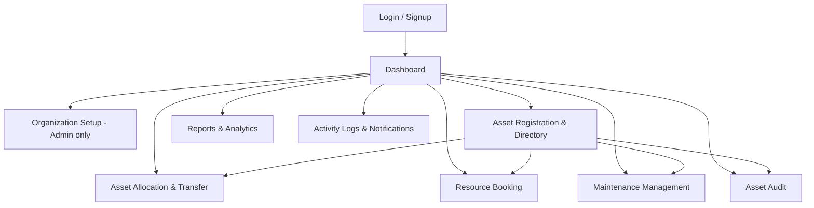

# AssetFlow — UI Flow

Visual language: monochrome shadcn/ui-style system (see `DESIGN.md` if supplied) — white/off-white surfaces, 18px pill radius on buttons/inputs, 24px radius cards, single red accent reserved for destructive/error states only. Sidebar layout, role-aware navigation.

## 1. Global Navigation Map

**Persistent shell:** left sidebar (nav items filtered by role) + top bar (search trigger, notification bell with unread badge, user menu). Sidebar item visibility:

| Nav item | Employee | Dept Head | Asset Manager | Admin |
|---|:-:|:-:|:-:|:-:|
| Dashboard | ✅ | ✅ | ✅ | ✅ |
| Organization Setup | ❌ | ❌ | ❌ | ✅ |
| Asset Directory | ✅ (view) | ✅ (view) | ✅ (view+edit) | ✅ |
| Allocation & Transfer | ✅ (own requests) | ✅ (dept approvals) | ✅ (full) | ✅ (full) |
| Resource Booking | ✅ | ✅ | ✅ | ✅ |
| Maintenance | ✅ (raise) | ✅ (view dept) | ✅ (approve/manage) | ✅ |
| Audit | ❌ (unless auditor) | ❌ (unless auditor) | ✅ | ✅ |
| Reports | limited | dept-scoped | ✅ | ✅ full |
| Activity Logs | own | dept | ✅ | ✅ full |

## 2. Screen-by-Screen

### 2.1 Login / Signup
- **Login card:** email, password, "Forgot password?" link, "Sign up" link. Ghost-button secondary, filled-button primary "Log in".
- **Signup card:** name, email, password, confirm password, department dropdown (populated from `departments`). No role field anywhere — copy under the form: "New accounts start as Employee. Ask an admin to grant additional access."
- **Forgot password:** email → "reset link sent" confirmation (demo: link also shown in console/dev banner).
- On success → redirect to Dashboard.

### 2.2 Dashboard
- Row of 6 **Stat Block** KPI cards (Assets Available, Assets Allocated, Maintenance Today, Active Bookings, Pending Transfers, Upcoming Returns).
- **Overdue Returns** panel: red-accented list, separate from **Upcoming Returns** (neutral list) below the KPI row.
- **Quick Actions** row: "Register Asset" (Asset Manager/Admin only), "Book Resource" (all), "Raise Maintenance Request" (all) — filled buttons.
- Two-column layout below: recent activity feed (left), mini booking calendar preview (right).

### 2.3 Organization Setup (Admin only, tabbed)
- **Tab A — Departments:** table (Name, Head, Parent, Status, Actions) + "New Department" drawer form (name, head select, parent select, status toggle).
- **Tab B — Asset Categories:** table (Name, Custom Fields count, Status, Actions) + drawer form with dynamic custom-field builder (key/label/type rows, add/remove).
- **Tab C — Employee Directory:** searchable/filterable table (Name, Email, Department, Role badge, Status). Row action "Manage Role" opens a modal — the *only* place in the product where role can change (Promote to Department Head / Asset Manager / revert to Employee, plus Active/Inactive toggle).

### 2.4 Asset Registration & Directory
- Top: search bar (Asset Tag / Serial / QR) + filter chips (Category, Status, Department, Location).
- Grid/table of Asset cards: photo thumbnail, Asset Tag, Name, Category badge, Status badge (color-coded per lifecycle state), Location.
- "Register Asset" (Asset Manager/Admin) opens a multi-section form: Basic Info → Category-specific custom fields (dynamic, driven by chosen category) → Acquisition → Photos/Docs → `isBookable` toggle. Asset Tag shown as read-only "auto-generated on save".
- **Asset Detail view** (click a card): header with QR code + status badge + primary actions (Allocate, Book if bookable, Raise Maintenance, Start Audit-independent) → tabs: **Overview**, **Allocation History**, **Maintenance History**.

### 2.5 Asset Allocation & Transfer
- List/table of assets filterable by status; each row shows current holder (if any).
- "Allocate" action on an `Available` asset → modal: allocate-to type (Employee/Department) + picker + optional Expected Return Date → Confirm.
- Attempting to allocate an `Allocated` asset instead surfaces an inline banner: *"Currently held by **Priya Sharma** — Allocated 12 Sep 2026"* with a single **Transfer Request** button (no raw allocate path shown).
- **Transfer Requests** sub-tab: table with Requested/Approved/Rejected/Completed status pills; Approve/Reject actions visible only to Asset Manager/Department Head (department-scoped for the latter).
- **Returns** sub-tab: mark-as-returned flow → condition check-in notes textarea → status badge flips to `Available`.
- Overdue rows highlighted in the ember/red accent.

### 2.6 Resource Booking
- Left: list of bookable resources (assets with `isBookable=true`).
- Right: calendar (day/week view) for the selected resource showing existing bookings as blocks.
- "New Booking" → resource (preselected) + date + start/end time + purpose. On submit, overlapping slot attempts show an inline error naming the conflicting booking's time range rather than a generic failure.
- Status pill per booking (Upcoming/Ongoing/Completed/Cancelled); Cancel/Reschedule actions on own (or department, for Dept Head) bookings.

### 2.7 Maintenance Management
- Kanban-style board: columns `Pending → Approved → Technician Assigned → In Progress → Resolved` (Rejected shown as a collapsible side column).
- Card = asset thumbnail, tag, priority badge (color by severity), requester.
- "Raise Request" form: asset picker (or launched pre-filled from Asset Detail), issue description, priority, photo upload.
- Asset Manager view adds Approve/Reject buttons on `Pending` cards and "Assign Technician" on `Approved` cards; drag or button-based column transitions.

### 2.8 Asset Audit
- **Audit Cycles** list (Planned/Active/Closed pills) + "New Audit Cycle" (Admin/Asset Manager): name, scope (departments/locations multi-select), date range, auditor multi-select.
- **Cycle detail:** progress bar (Verified/Missing/Damaged/Pending counts), asset checklist for assigned auditors to mark Verified/Missing/Damaged with optional note.
- **Discrepancy Report** tab: auto-filtered Missing/Damaged list, exportable.
- "Close Cycle" button (confirmation modal: "This will lock the cycle and update N asset statuses") — disabled until required marks complete or explicit override checkbox for partial close.

### 2.9 Reports & Analytics
- Filter bar: date range, department, category.
- Cards/charts: utilization bar chart (most-used vs idle), maintenance-frequency chart, "nearing retirement" table, department allocation summary table, booking heatmap (hour × day grid).
- "Export" button per report block (CSV).

### 2.10 Activity Logs & Notifications
- Notification bell dropdown (top bar): recent unread-first list, mark-as-read on click, "View all" link.
- Full-page **Activity Log** (Admin/Asset Manager, filtered for others): table of actor, action, entity, timestamp, with filters for user/entity-type/date-range.

## 3. Interaction Conventions

- Conflict errors (allocation, booking) render as **inline banners at the point of action**, never a generic toast alone — they must show *why* and *what to do next* (per FR-5.2/FR-6.2).
- Destructive actions (Reject, Cancel, Close Audit, Deactivate) always confirm via modal, styled with the single ember/red accent.
- All list screens share one table/filter shell component for consistency (search + filter chips + paginated table).
