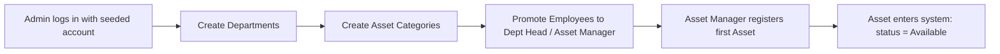
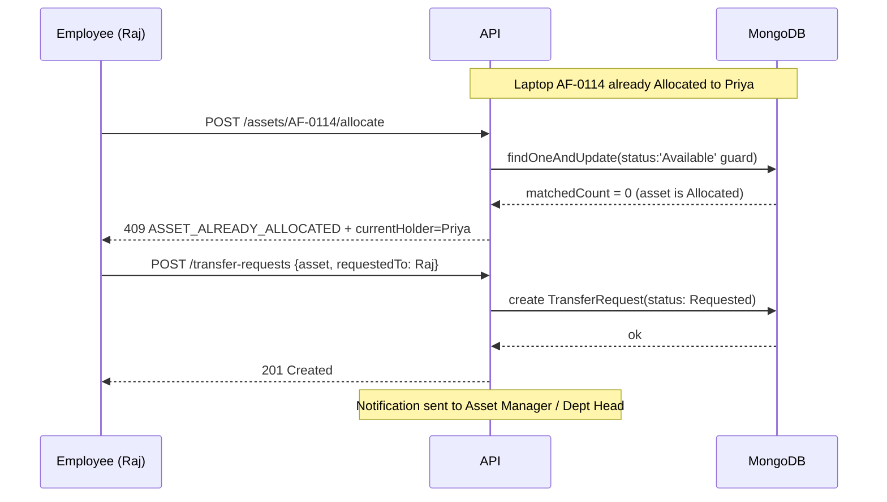
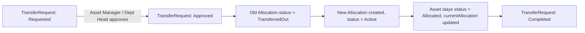
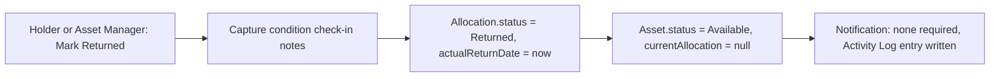
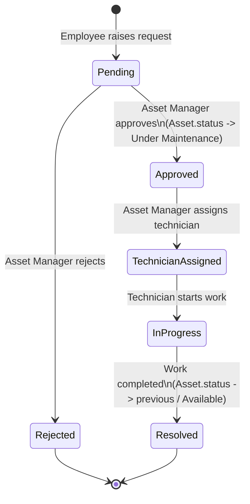
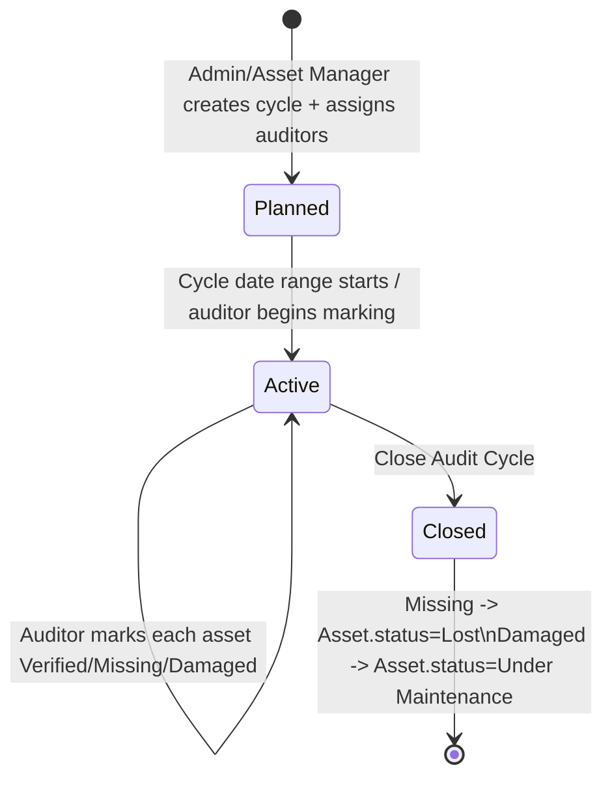
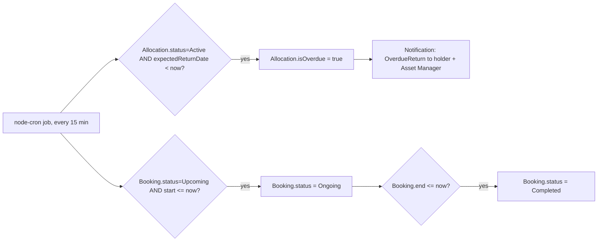

# AssetFlow — Application Flow

End-to-end process flows and state machines underlying the UI. These are the flows to actually demo.

## 1. Master Setup → First Asset (bootstrap flow)



## 2. Allocation Conflict Flow (core demo scenario)



**Transfer approval → re-allocation:**


## 3. Return Flow



## 4. Booking Overlap Flow (core demo scenario)

```mermaid
sequenceDiagram
    participant U as User
    participant API as API
    participant DB as MongoDB

    Note over DB: Room B2 booked 09:00-10:00
    U->>API: POST /bookings {resource: B2, start: 09:30, end: 10:30}
    API->>DB: findOne overlap query (start<10:30 AND end>09:30)
    DB-->>API: conflict found (09:00-10:00 booking)
    API-->>U: 409 BOOKING_OVERLAP + conflicting booking detail
    U->>API: POST /bookings {resource: B2, start: 10:00, end: 11:00}
    API->>DB: findOne overlap query (start<11:00 AND end>10:00)
    DB-->>API: no match (back-to-back is fine)
    API->>DB: insert Booking(status: Upcoming)
    API-->>U: 201 Created
    Note over API: Notification: BookingConfirmed; reminder scheduled
```

## 5. Maintenance Lifecycle



## 6. Audit Cycle Lifecycle



## 7. Overdue Detection (background flow)



## 8. Role Journey Summaries

- **Employee:** Signup → Dashboard (own view) → browse Asset Directory → book a resource or raise a maintenance request → see own notifications/overdue flags.
- **Department Head:** everything Employee does + Dashboard scoped to department → approve allocation/transfer requests originating in department → book resources on behalf of department.
- **Asset Manager:** register assets → allocate/transfer → approve maintenance → manage audits → resolve discrepancies → org-wide reports.
- **Admin:** Organization Setup (departments, categories, role promotion) → org-wide dashboard/reports → oversight of all activity logs.

## 9. Cross-Cutting: Notification Fan-Out

Every state-changing action in §2–7 writes both (a) one or more `Notification` documents to the relevant user(s), and (b) exactly one `ActivityLog` entry recording actor/action/entity/timestamp — this is what powers the Dashboard activity feed and the Activity Logs screen without any special-cased queries.
